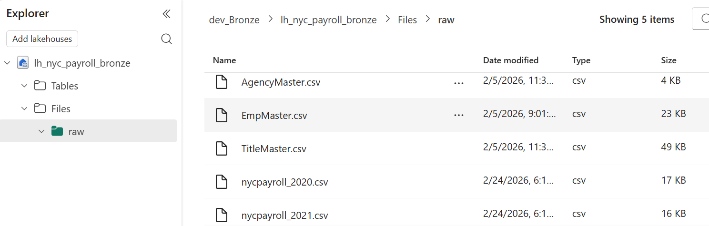
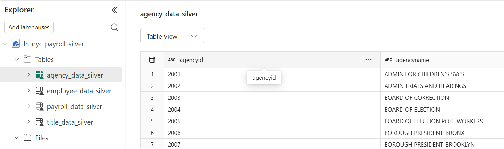
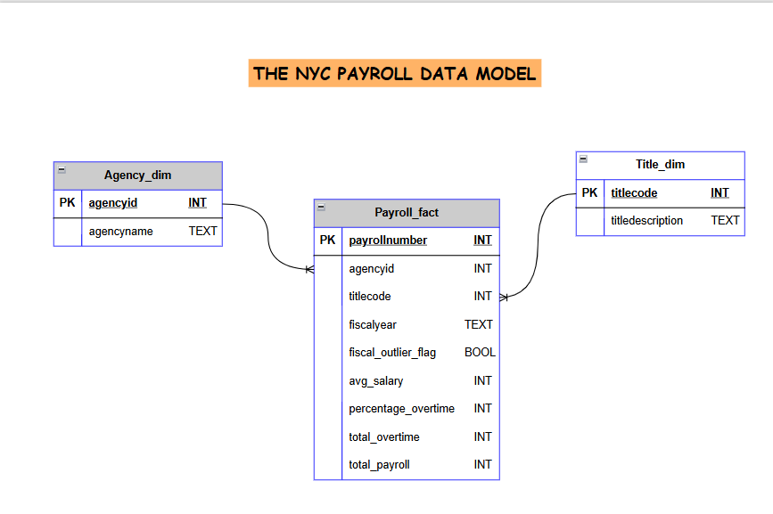
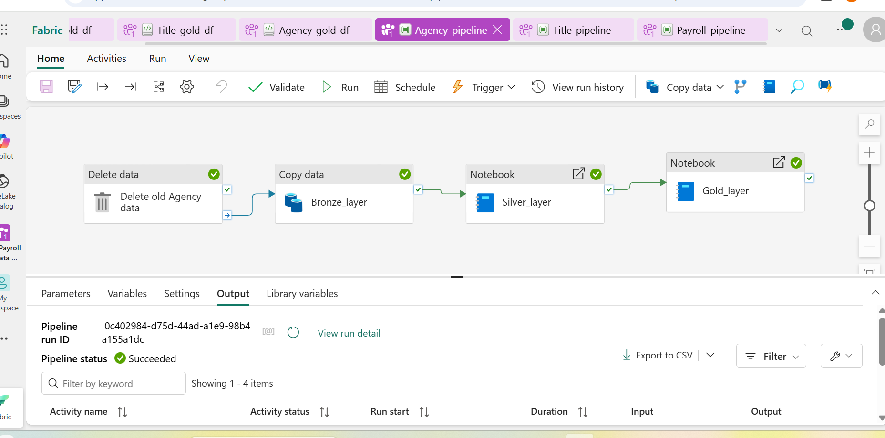
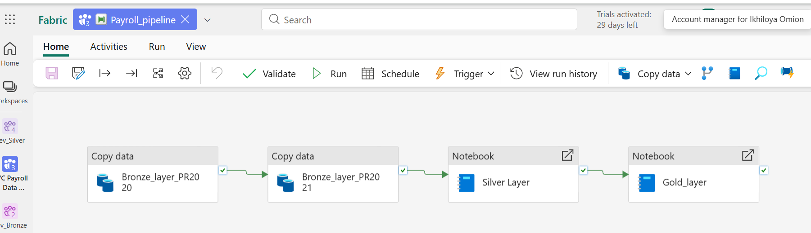
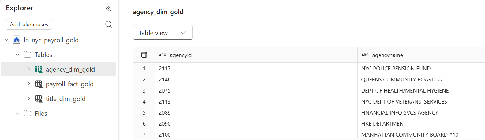
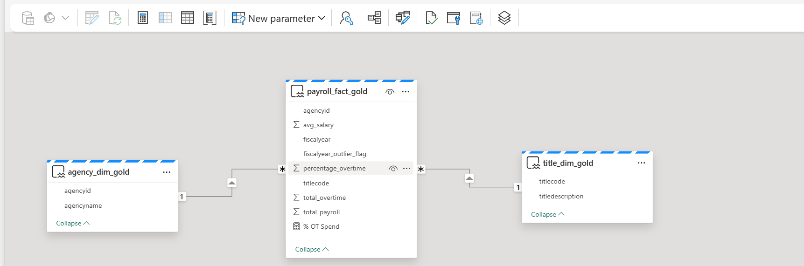
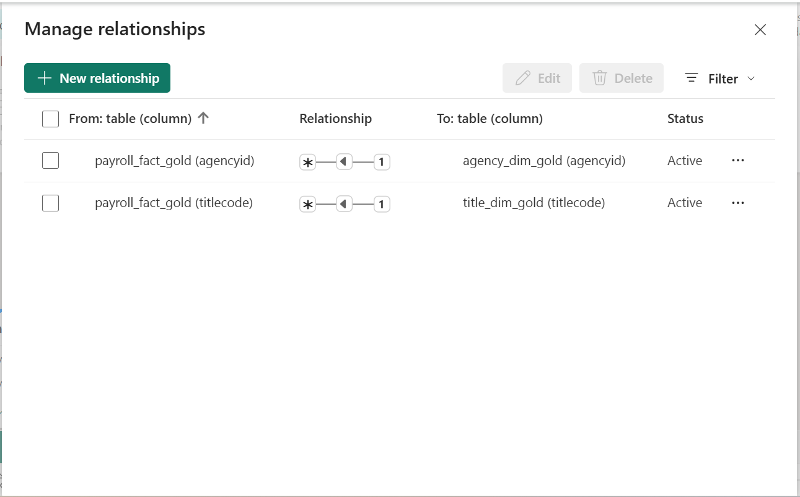
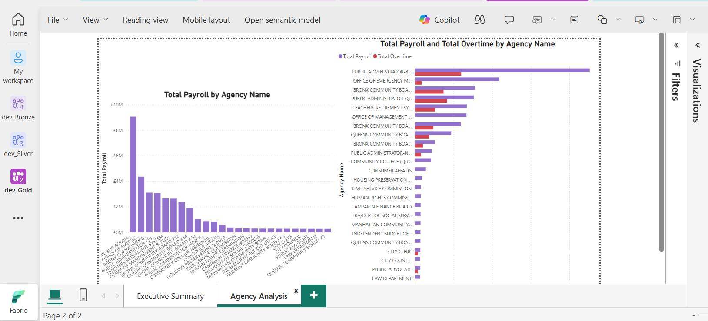
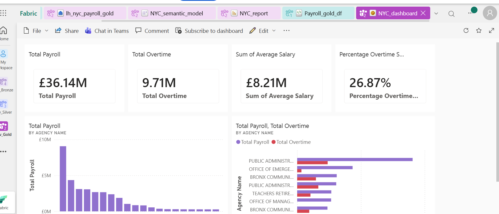

# NYC Payroll Data Integration & Analytics 
## Centralized Payroll Insights Using Microsoft Fabric

## Background Story
The **NYC Payroll Data Integration & Analytics Project** was developed to centralize payroll data from multiple New York City agencies into a single, unified reporting platform.
Previously, payroll information was stored in separate datasets, limiting visibility into overtime spending, salary trends, and agency-level budget comparisons. This fragmentation made consolidated reporting time-consuming and less transparent.

## Project Overview

This project establishes a reliable “single source of truth” for payroll analytics using Microsoft Fabric and Power BI. The solution integrates payroll data into one structured and scalable environment, where it is standardized and prepared for executive reporting.

The project was designed to:

* Consolidate payroll data into one platform
* Improve visibility into overtime and salary spending
* Support executive-level decision-making
* Provide consistent and transparent reporting

The final outcome is a centralized analytics dashboard that delivers clear insights into payroll performance across NYC agencies, supporting accountability and strategic planning.

---

## Technology Platform

The project was built using:

* **Microsoft Fabric** – Unified data platform for ingestion, transformation, modeling, and reporting
* **OneLake Lakehouse** – Centralized storage implementing Bronze, Silver, and Gold layers
* **Fabric Data Pipelines** – Automated data ingestion
* **PySpark Notebooks** – Data cleaning, transformation, and aggregation
* **Delta Lake** – Optimized and reliable table storage
* **SQL Endpoint & Semantic Model** – Structured data modeling for reporting
* **Power BI & DAX** – Dashboard creation and KPI calculations
* **GitHub** – Version control and documentation

---

## Data Pipeline Architecture (High Level End to End Flow)


---

# Project Approach

This project was implemented using a structured **Medallion Architecture (Bronze → Silver → Gold)** within Microsoft Fabric. The solution follows an end-to-end data engineering workflow:
Data Ingestion → Data Transformation → Data Modeling → Analytics & Reporting

## 1. Data Ingestion – Bronze Layer
The Bronze layer stores raw datasets exactly as received from source systems.

### Folder Structure
Raw files are stored in the Bronze Lakehouse:

```
/Files/raw/
    ├── Agency_records
    ├── Employee_records
    ├── Title_records
    └── Payroll_records
```

### Pipeline Configuration

Each dataset is ingested using a **Fabric Data Pipeline** with the Copy Data activity:

* **Source:** CSV (HTTP)
* **Sink:** Bronze Lakehouse
* **Format:** Delimited Text (CSV)
* **Pre-load step:** Delete activity to prevent duplicate records

### Process Steps:

1. Create pipeline
2. Add Copy Data activity (`Bronze_layer`)
3. Configure source and sink
4. Validate and run
5. Add Delete activity before Copy
6. Save and re-run

**Output:** Raw CSV files securely stored in Bronze Lakehouse.

* ## *Bronze Lakehouse (lh_nyc_payroll_bronze)* 
---

## 2. Data Cleaning & Transformation – Silver Layer
The Silver layer standardizes and cleans the raw datasets using **PySpark notebooks**

### Transformation Steps:

1. Load raw data from Bronze
2. Standardize column names
3. Remove duplicates
4. Handle null values
5. Flag outliers (e.g., fiscal year anomalies)
6. Cast columns to consistent data types
7. Write cleansed data as Delta tables

## Pipeline Integration

Each dataset has a dedicated notebook (e.g., `Agency_silver_df`), and each Silver notebook is connected to its pipeline:

* Activity Name: `Silver_layer`
* Parameterized base variable:

  ```
  table_name = "agency_data_silver"
  ```
**Output:** Clean, validated Delta tables in Silver Lakehouse.

* ## *Silver Lakehouse(lh_nyc_payroll_silver)* 
---

## 3. Data Aggregation & Modeling – Gold Layer
The Gold layer prepares business-ready datasets optimized for reporting.

## Data Modeling

Gold notebooks (e.g., `Payroll_gold_df`) perform:
1. Load data from Silver
2. Build Fact and Dimension tables
3. Derive KPIs:
   * Total Payroll
   * Total Overtime
   * Average Salary
4. Write tables to Gold Lakehouse. Example of tables:
   * `agency_dim_gold`
   * `title_dim_gold`
   * `payroll_fact_gold`


*  ## *Data Model: Star Schema Model Optimized for Analytics* .


## Pipeline Integration
Each Gold notebook is added to the pipeline:

* Activity Name: `Gold_layer`
* Parameterized base variable:

  ```
  table_name = "payroll_data_gold"
  ```

* ## *Agency Data Pipeline* 

* ## *Payroll Data Pipeline* 


* ## *Gold Lakehouse (lh_nyc_payroll_gold)* 
---

## 4. Analytics & Visualization
Using the Gold Lakehouse SQL Endpoint:

1. Create Semantic Model: `NYC_semantic_model`
2. Select Gold tables:

   * agency_dim_gold
   * title_dim_gold
   * payroll_fact_gold

* ## *Semantic Model View* 

3. Define relationships:

   * One-to-many (1:*)
   * Single-direction filtering

* ## *Semantic Model Relationships* 
---

## Power BI Report Development

Report Name: `NYC_report`

### Executive KPIs:

* Total Payroll (Currency)
* Total Overtime (Currency)
* % Overtime Spend (DAX measure)
* Fiscal Year slicer

## Visualizations:

* ## *Executive Summary Report* 
* ## *Payroll/Agency Analysis Report* 

---

## 5. Dashboard & App Deployment

Final reporting solution was deployed as a Power BI App using the following deployment steps:

1. Create dashboard in workspace
2. Pin report visuals
3. Create Power BI App
4. Enable:
   * User copy access
   * Automatic installation
5. Add dashboard content
6. Configure user access
7. Publish App

The Power BI dashboard provides stakeholders with:
- **Total Payroll Spending**
- **Total Overtime Spending**
- **Average Salary**
- **Percentage of Payroll Spent on Overtime**

These insights support budget planning and financial transparency.

* ## *Power BI Dashboard* 

---

# Business Value
This solution provides:
- A centralized payroll data platform  
- Improved transparency in overtime usage  
- Faster access to accurate payroll insights  
- Scalable architecture for future expansion  
- Structured reporting for internal and public use  

---

# Challenges & Resolutions
During the implementation of the NYC Payroll Data Integration & Analytics project, several technical challenges were encountered and resolved.

## 1. Duplicate Columns & Join Inconsistencies

While attempting to join the **Payroll** and **Employee** datasets in the Silver layer, both tables contained overlapping columns such as `firstname` and `lastname`.
Since Apache Spark does not allow duplicate column names when writing a table, this resulted in a write error.

### Resolution:

* Dropped redundant columns from the Payroll dataset before writing the final Silver table.
* Ensured only necessary and unique columns were retained.

Additionally, a reliable join between Payroll and Employee tables could not be established using `employeeid`, as identifier values did not align across datasets. An inner join returned no records due to this inconsistency.

### Mitigation:

* Adjusted the modeling approach to avoid dependency on unreliable joins.
* Focused on payroll-based aggregations that ensured data integrity.

---

## 2. Data Type Mismatch in Semantic Model

During the creation of relationships between fact and dimension tables in the Semantic Model, a data type mismatch error occurred.

Microsoft Fabric / Power BI does not allow relationships between columns with different data types, which prevented relationship creation.

### Resolution:

* Standardized data types in the Silver layer.
* Explicitly cast both primary and foreign key columns to the same data type.
* Reloaded the Gold tables.
* Refreshed the Semantic Model and successfully recreated relationships.

This ensured referential integrity within the reporting layer.

---

## 3️. Capacity Limitations in Fabric (Free Version)

While running the Payroll data pipeline, the project encountered **capacity constraints** due to using the free version of Microsoft Fabric.

This resulted in pipeline execution interruptions when compute resources were temporarily unavailable.

### Resolution:

* Monitored capacity usage during pipeline execution.
* Re-ran pipelines during lower utilization periods.
* Optimized notebook logic to reduce unnecessary compute load.

This experience highlighted the importance of capacity planning in production environments.

---

# Governance & Security

The solution was designed with governance, data integrity, and controlled access in mind.

**Key governance and security measures include:**

* **Role-Based Workspace Access Control**
  Access to the Microsoft Fabric workspace is restricted based on user roles, ensuring that only authorized personnel can create, modify, or publish data assets.

* **Layered Data Architecture (Medallion Model)**
  Data is logically separated across Bronze (raw), Silver (cleaned), and Gold (reporting) layers to preserve source integrity, maintain transformation traceability, and support auditability.

* **Secure Report Distribution**
  Reports are published through Power BI using controlled workspace permissions and app-based distribution, ensuring that end users can securely access dashboards without direct access to underlying datasets.


---

## Conclusion

This project demonstrates how modern data engineering practices can transform fragmented payroll datasets into a centralized, reliable, and actionable analytics platform.

The result is improved financial visibility, better oversight of overtime spending, and enhanced decision-making capabilities for stakeholders.

---

**Author:** [Ikhiloya Omion]  
**Role:** Data Engineer  
**Project Type:** Capstone Project  
**Platform:** Microsoft Fabric